<!-- ─────────────── BANNIÈRE ─────────────── -->
<p align="center">
  
</p>

<!-- ─────────────── TEXTE ANIMÉ ─────────────── -->
<p align="center">
  <a href="https://github.com/Anonyme-00152">
    
  </a>
</p>

<!-- ─────────────── BADGES ─────────────── -->
<p align="center">
  <a href="https://github.com/Anonyme-00152?tab=followers"></a>
  <a href="https://github.com/Anonyme-00152?tab=repositories"></a>
  
</p>

<br/>

<!-- ─────────────── À PROPOS ─────────────── -->
##  À propos

<table>
<tr>
<td width="56%" valign="top">

```ts
const ebubekir = {
  role:     "Développeur Full-Stack",
  basé:     "France 🇫🇷",
  front:    ["React", "Next.js", "Tailwind CSS"],
  back:     ["Supabase", "Prisma", "Node.js"],
  aussi:    ["Python", "C#", "PowerShell"],
  passion:  ["IA", "Outils dev", "UI soignées"],
};
```

</td>
<td width="44%" valign="top">

- 🧠 Je développe **[MindVault](https://github.com/Anonyme-00152/Gestion-Application)**, un assistant perso avec notes, agenda et IA, 100 % local
- 🐺 Créateur de **[Crimson-Wolf](https://github.com/Anonyme-00152/Crimson-Wolf)** ⭐
- 🎨 J'aime les interfaces modernes et animées
- 🌱 J'apprends en continu : IA, SaaS, outils Windows
- 🤝 Ouvert aux collaborations open source

</td>
</tr>
</table>

<!-- ─────────────── STACK ─────────────── -->
##  Stack technique

<p align="center"><b>Langages</b></p>
<p align="center">
  
</p>

<p align="center"><b>Front-end</b></p>
<p align="center">
  
</p>

<p align="center"><b>Back-end & données</b></p>
<p align="center">
  
</p>

<p align="center"><b>Outils</b></p>
<p align="center">
  
</p>

<!-- ─────────────── PROJETS ─────────────── -->
##  Projets phares

<p align="center">
  <a href="https://github.com/Anonyme-00152/Gestion-Application"></a>
  <a href="https://github.com/Anonyme-00152/Crimson-Wolf"></a>
</p>

<!-- ─────────────── STATS ─────────────── -->
##  Statistiques GitHub

<p align="center">
  
  
</p>

<p align="center">
  
</p>

<!-- ─────────────── SNAKE ─────────────── -->
<p align="center">
  <picture>
    <source media="(prefers-color-scheme: dark)" srcset="https://raw.githubusercontent.com/Anonyme-00152/Anonyme-00152/output/snake-dark.svg"/>
    <source media="(prefers-color-scheme: light)" srcset="https://raw.githubusercontent.com/Anonyme-00152/Anonyme-00152/output/snake.svg"/>
    
  </picture>
</p>

<!-- ─────────────── PIED DE PAGE ─────────────── -->
<p align="center">
  
</p>
