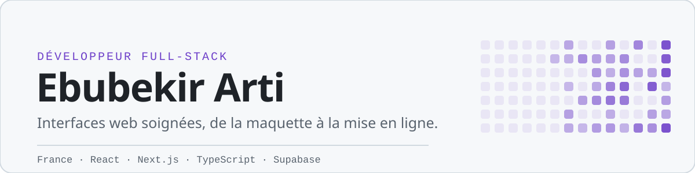
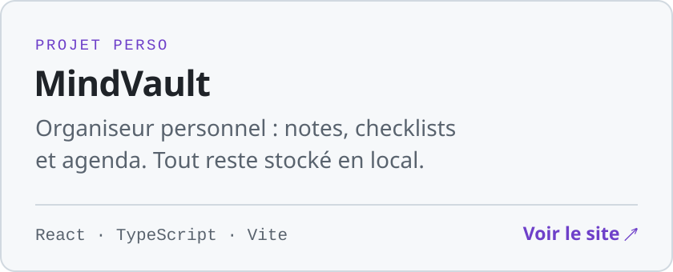
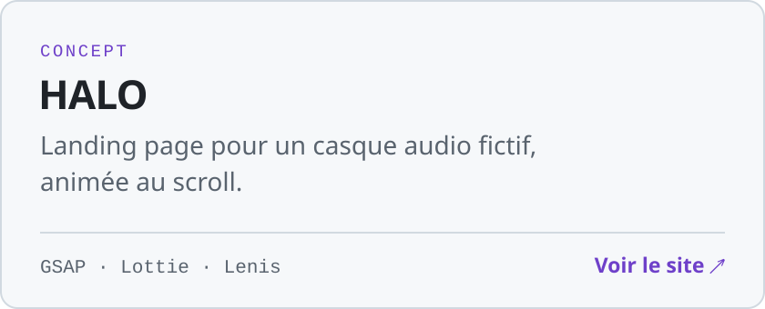
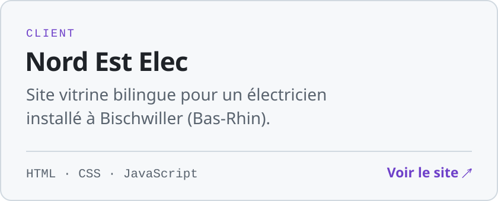
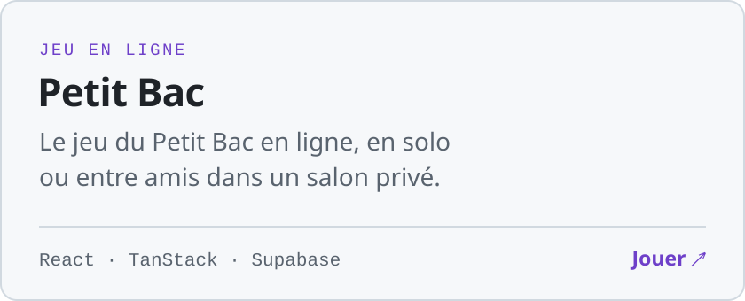

<picture>
  <source media="(prefers-color-scheme: dark)" srcset="./assets/header-dark.svg">
  
</picture>

 

Je développe des sites et des applications web avec React, Next.js et TypeScript. J'aime les interfaces rapides, lisibles et soignées dans le détail.

En ce moment, je travaille sur **MindVault**, un organiseur personnel qui fonctionne entièrement en local, et je réalise des sites vitrines pour des artisans et des petites entreprises.

### Projets

<a href="https://gestion-application.vercel.app/"><picture><source media="(prefers-color-scheme: dark)" srcset="./assets/mindvault-dark.svg"></picture></a>
<a href="https://halo-headphones.vercel.app"><picture><source media="(prefers-color-scheme: dark)" srcset="./assets/halo-dark.svg"></picture></a>
<a href="https://nord-est-elec.vercel.app"><picture><source media="(prefers-color-scheme: dark)" srcset="./assets/nord-est-elec-dark.svg"></picture></a>
<a href="https://deploy-my-code-084d89d2.vercel.app"><picture><source media="(prefers-color-scheme: dark)" srcset="./assets/petit-bac-dark.svg"></picture></a>

Code source : [mindvault](https://github.com/Anonyme-00152/mindvault) · [halo](https://github.com/Anonyme-00152/halo) · [nord-est-elec](https://github.com/Anonyme-00152/nord-est-elec) · [petit-bac](https://github.com/Anonyme-00152/petit-bac) · [aetheris-vault](https://github.com/Anonyme-00152/aetheris-vault)

### Outils

**Front-end** — React, Next.js, TypeScript, Tailwind CSS, GSAP 
**Back-end** — Node.js, Supabase, Prisma, PostgreSQL 
**Aussi** — Python, C#, PowerShell, Git, Vercel

### Contact

Une idée de site, une mission ou une question ? [Écris-moi ici](https://github.com/Anonyme-00152/Anonyme-00152/issues/new), je réponds rapidement.
